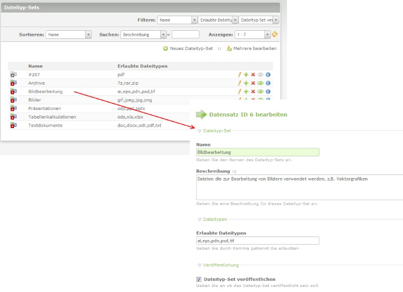
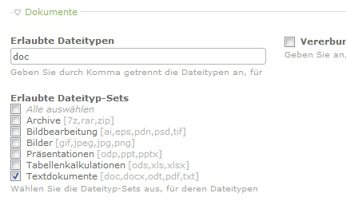

Contao Extension: DocumentManagementSystemFileTypeSets
======================================================

Provides file type sets for the [[Contao DMS]](https://github.com/ContaoDMS/dms).

Installation
------------

Install the extension via composer: [contao-dms/file-type-sets](https://packagist.org/packages/contao-dms/file-type-sets).

If you prefer to install it manually, download the latest release here: https://github.com/ContaoDMS/dms-FileTypeSets/releases

Tracker
-------

https://github.com/ContaoDMS/dms-FileTypeSets/issues

Compatibility
-------------

- min. Contao version: >= 3.2.0
- max. Contao version: <  3.5.0

Dependency
----------

- This extension is dependent on the following extensions: [[contao-dms/dms]](https://packagist.org/packages/contao-dms/dms)

Screenshots
-----------

